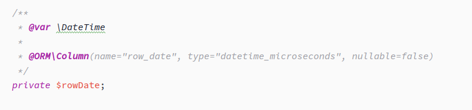
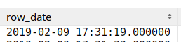

Doctrine DateTime With Microseconds
====================================
Doctrine plugin to save DateTime objects with microseconds in database.
------------------------------------

-----------

### Standard Doctrine behavior

Doctrine saves `\DateTime` to the database correctly, but omits the microseconds, which are part of the `\DateTime` object. 

### Example mapping:

The Doctrine ORM saves the date, but without microseconds:

In some systems this behavior is not expected. There are some situations where the microseconds are very important information, so they should be persisted.

***Caution: Not every Database system supports Timestamps with microseconds***

## Requirements

* PHP version 7.2+ (tested on 7.2, 7.3, 7.4)

## TODO

- [ ] Integration with TravisCI
- [ ] Run matrix
- [ ] Integration test All DB tests 
- [ ] installation tutorial

