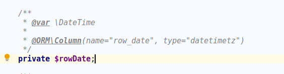
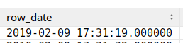

Doctrine DateTime With Microseconds
====================================
Doctrine plugin to save DateTime objects with microseconds in database.
------------------------------------

-----------

## Installation

Via composer

`composer require bartoszbartniczak/doctrine-datetime-with-microseconds`

## How does it work?

### Standard Doctrine behavior

Doctrine saves `\DateTime` to the database correctly, but omits the microseconds, which are part of the `\DateTime` object. 

### Standard doctrine mapping:

The Doctrine ORM saves the date, but without microseconds:

In some systems this behavior is not expected. There are some situations where the microseconds are very important information, so they should be persisted.

***Caution: Not every Database system supports Timestamps with microseconds.***

### How to use?

This library resolves problem of persisting microseconds with Doctrine.

### Mapping

Instead of using standard Doctrine type `datetime`, you can use `datetime_microseconds`

After persisting object, you should have seen datetime value with microseconds saved.

## Supported Relational Database Management Systems

* PostgreSQL

## Table of compatibility

|             | PHP 7.2 | PHP 7.3 |  PHP 7.4 |
|-------------|------------------|------------------|------------------|
| Postgres 9  |:heavy_check_mark:|:heavy_check_mark:|:heavy_check_mark:|
| Postgres 10 |:heavy_check_mark:|:heavy_check_mark:|:heavy_check_mark:|
| Postgres 11 |:heavy_check_mark:|:heavy_check_mark:|:heavy_check_mark:|
| Postgres 12 |:heavy_check_mark:|:heavy_check_mark:|:heavy_check_mark:|
| MySQL 5\* | :heavy_check_mark: | :heavy_check_mark: | :heavy_check_mark: |
| MySQL 8 | :heavy_check_mark: | :heavy_check_mark: | :heavy_check_mark: |

_\*Microseconds are supported since version 5.6_

## Other Relational Database Management Systems

If your RDBMS is not pointed on the list above, it does not mean that it will not work. It means that this library was not tested yet with that databse system. You can try and test it yourself, or even try contribute to this project.

* **MariaDB** - Not tested yet
* **Microsoft SQL Server** - Not tested yet
* **Oracle database** - Not tested yet
* **SQLite** - Not tested yet

